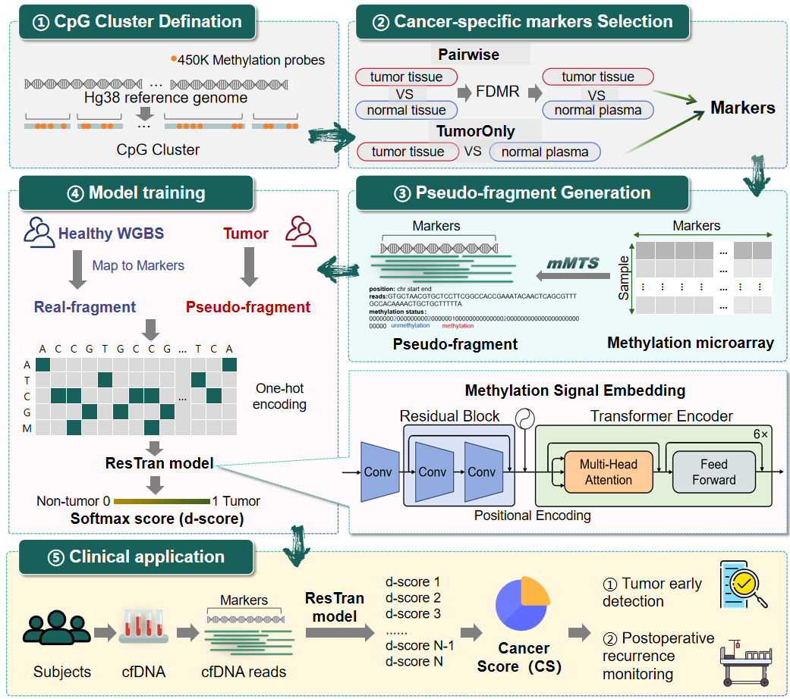
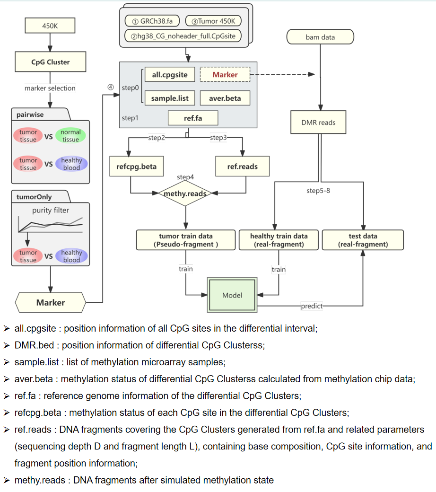

# DeepBL
## Overview
In this study, we introduce our novel deep learning model, DeepLB, developed for early cancer detection through liquid biopsy. This model utilizes pseudo-fragment data generated from 450K methylation array data of tumor tissues, alongside cfDNA whole-genome bisulfite sequencing (WGBS) data from healthy donors, to enhance diagnostic capabilities. DeepLB consists of four key modules: feature selection, methylation Microarray-To-Sequence data converter (mMTS), deep learning model (ResTran), and cancer score estimation. We analyzed cancer-specific features from tumor tissue and healthy plasma WGBS data, generating tumor pseudo-fragment data through the mMTS converter. The ResTran model, which integrates residual networks with Transformer architecture, accurately identifies tumor-derived DNA fragments from cfDNA methylation sequencing data. The workflow in DeepLB is illustrated in the figure below.





# DeepLB

## Table of Contents
- [DeepBL](#deepbl)
  - [Overview](#overview)
- [DeepLB](#deeplb)
  - [Table of Contents](#table-of-contents)
  - [Installation](#installation)
  - [Prepare data](#prepare-data)
    - [Warning!!](#warning)
  - [Part1: Marker Selection](#part1-marker-selection)
  - [Part2: Pseudo-fragment Generation by mMTS](#part2-pseudo-fragment-generation-by-mmts)
  - [Part3: Deep Learning (ResTran) model training](#part3-deep-learning-restran-model-training)
- [Use](#use)
- [Citation](#citation)


## Installation
```R
install.packages('devtools')
devtools::install_github("labxscut/DeepLB")
```
```
../DeepLB/
├── env
├── codes # from CancerLocator and CancerDetector
├── log # for process log
├── Predata # The data should be prepare before Process DeepLB
├── Result 
└── Scripts
    ├── Part1.Marker_Selection
    ├── Part2.Pseudo-fragment_Generation_by_mMTS
    └── Part3.ResTran_model_training
```

## Prepare data
!!!!! The data should be prepare before Process DeepLB
```
Predata/
├── 450K #Download from GEO and TCGA
│   ├── illuminaMethyl450_hg38_GDC 
│   ├── TCGA_450_probe 
│   ├── TCGA-LIHC.methylation450.tsv #tumor 450K data
│   └── TCGA_Study_Abbreviations.txt
├── metadata
│   ├── all_samples_annotation.txt #tumor tissue and normal plasma annotation
│   ├── background_for_train.txt # normal plasma list
│   └── all_WGBS_sample_metadata.xlsx # plasma sample metadata
├── reference
│   ├── cpg_system
│   │   ├── chrom_list.txt
│   │   ├── hg38_CG_noheader_full.CpGsite
│   ├── GRCh38
│   │   ├── Bisulfite_Genome
│   │   ├── GRCh38.fa
│   │   ├── GRCh38.fa.fai
│   │   ├── hg38.chrom.sizes
│   │   ├── index.html
│   │   └── sequence.fa
│   ├── hg38_chromInfo.table
│   ├── hg38.genome.refined.table
│   ├── hg38_repeat
│   └── reformat.sh # for generate hg38.genome.refined.table
├── tumor_purity
│   └── LIHC_purity.csv # generate by Part1
└── WGBS 
```

### Warning!!
Before use mMTS, please check the env_module.py and make sure each file path is right

## Part1: Marker Selection
- 1.1 Prepare 450K data
- 1.2 Identify CpG Clusters
- 1.3 Quantifying the methylation level of CpG clusters
- 1.4 Split Cohort for cross validation
- 1.5 Estimate statistical parameters
- 1.6 Marker Selection
  
```
Scripts/
├── Part1.Marker_Selection
│   ├── 1.1_reformat_TCGA.R
│   ├── 1.1_subsample_for_tumorOnly.R
│   ├── 1.2_add_complementary_bins.py
│   ├── 1.2_define_blocks_according_CancerLocator_method.R
│   ├── 1.2_refine_blocks.sh
│   ├── 1.3.1_get_methylation_ratio_blocks_TCGA_paired.R
│   ├── 1.3.2_get_methylation_ratio_blocks_TCGA_tumorOnly.R
│   ├── 1.3.3_extract_reads_from_normal_plasma.sh
│   ├── 1.3.4_get_methylation_ratio_blocks_normal_plasma.R
│   ├── 1.4.1_gen_rand_runs_paired.py
│   ├── 1.4.1_submit_paired_PH.sh
│   ├── 1.4.2_gen_rand_runs_tumorOnly.py
│   ├── 1.4.2_submit_tumorOnly_THorMH.sh
│   ├── 1.5_para_est_mom_mc.R
│   ├── 1.5_submit_est.sh
│   ├── 1.6.1_sel_markers_paired.py
│   ├── 1.6.1_submit_sel_markers_paired.sh
│   ├── 1.6.2_sel_markers_tumorOnly.py
│   ├── 1.6.2_submit_sel_markers_tumorOnly.sh
│   └── 1.6.3_add_complementary_bins.py
Result/
├── 1.1_450K_reformate_data
├── 1.2_define_bins
├── 1.3_cal_methylratio_bins
├── 1.3_extract_reads
├── 1.4_gen_rand_runs
├── 1.5_train_model_for_parameters
├── 1.6_select_marker
```

## Part2: Pseudo-fragment Generation by mMTS
- step0 : prepare sample list,marker bed file, markers' CpG methylation status file and CpG site position file
- step1 : obtain the markers reference gene from GRCH38.fa
- step2 : prepare each CpG site's methylation status in markers
- step3 : generate reference DNA reads from markers reference gene
- step4 : simulate methylation status for reference DNA reads(methy.reads)
- step5-6 : obtain the part of markers from plasma WGBS bam file 
- step7 : transfer methy.reads to pseudo-fragments for model training
- step8 : extract DNA reads and methy status from bam file of plasma sample
```
Scripts/Part2.Pseudo-fragment_Generation_by_mMTS/
├── 2.0_prepare_files_paired.py
├── 2.0_prepare_files_tumorOnly.py 
├── 2.1_gen_DMRref_gene_more1.py
├── 2.2_generate_cpg_ref_beta.py
├── 2.3_gen_dmr_reads.py
├── 2.4_simulate_methy_improve.py
├── 2.5_select_healthy_bam_to_train.py
├── 2.6_select_bam_test_all.py
├── 2.7_trans_to_train_read.py
├── 2.8_extract_bam_to_reads.py
├── env_module.py # Must change the direction before process this part!! 
├── mMTS-pipeline.py
Result/2.simulation_result/
├── paired
│   └── lihc-PH
│       ├── 2-0_process
│       ├── 2-1_ref_cpg_beta
│       ├── 2-2_ref_reads
│       ├── 2-3_simulated_reads
│       ├── 2-4_reads_to_train
│       ├── 2-5_real_process_bam
│       ├── 2-6_reads_to_test
│       └── log
└── tumorOnly
```

## Part3: Deep Learning (ResTran) model training
```
Scripts/Part3.ResTran_model_training/
├── training.py
├── 3models.py
├── predict_reads_source.py
├── cal_risk.py
├── ResTran.sh
Result/3.ResTran_results
├── train_result
│   └── lihc-PH
│       ├── 1_0.4
└── train_result
│       ├── 1_0.4
``` 

# Use
Usage: DeepLB_pipeline.sh [OPTIONS]
Options (full names and abbreviations):
  --root_dir, -r <ROOT_DIR>          : Root directory of the project
  --tumor, -t <TUMOR>               : Tumor sample identifier (e.g., lihc, brca)
  --group, -g <GROUP>              : Group identifier (e.g., PH, TH, MH)
  --subsample, -s <SUBSAMPLE>      : Subsample identifier (e.g., top30, sub30)
  --annotation_file, -a <FILE>     : Annotation file path
  --normal_sample_list, -n <FILE> : Normal sample list file path
  --marker_selection_threshold, -m <THRESHOLD> : Marker selection threshold (e.g., "0.1 0.15 0.2")
  --validation, -v <VALIDATION>     : Validation identifier (1~10)
  --window_size, -w <SIZE>         : Window size for CpG clusters
  --min_probe, -p <COUNT>         : Minimum number of probes
  --module, -u <MODULE>            : Module to run (part1, part2, part3, all)
  --marker_type, -k <TYPE>        : Marker type for pseudo-fragment generation
  --begin_list, -b <FILE>         : Begin list file path
  --coverage, -c <COVERAGE>       : Coverage threshold
  --generation_threshold, -q <THRESHOLD> : Generation threshold (selected from marker selection threshold)
  --fragment_length, -l <LENGTH>  : Fragment length for pseudo-fragment generation
  --meta, -x <FILE>               : Meta file path
  --dry_run, -d|-n                : Enable dry-run mode
  --help, -h                      : Display this help message

```
#Example
# Only part1
bash DeepLB_pipeline.sh -r /home/yinliang/PROJECT/DeepLB -t lihc -g TH -s top30 -a all_samples_annotation.txt -n background_for_train.txt -m "0.1 0.15 0.2" -v 1 -w 100 -p 3 -u part1
# Only part2
bash DeepLB_pipeline.sh -r /home/yinliang/PROJECT/DeepLB -t lihc -g TH -q 0.1 -k "hyper" -v 1 -s top30 -b begin_list.txt -c 3 -l 66 -u part2
# Only part3
bash DeepLB_pipeline.sh -r /home/yinliang/PROJECT/DeepLB -t lihc -g TH -q 0.1 -k "hyper" -v 1 -u part3
# ALL
bash DeepLB_pipeline.sh -r /home/yinliang/PROJECT/DeepLB -t lihc -g TH -s top30 -a all_samples_annotation.txt -n background_for_train.txt -m "0.1 0.15 0.2" -v 1 -w 100 -p 3 -q 0.1 -k marker_type -b begin_list.txt -c 30 -l 66 -u all

```

# Citation

**If you use this code for your research, please cite paper:**

Kang S, Li Q, Chen Q, Zhou Y, Park S, Lee G, Grimes B, Krysan K, Yu M, Wang W, Alber F, Sun F, Dubinett SM, Li W, Zhou XJ. CancerLocator: non-invasive cancer diagnosis and tissue-of-origin prediction using methylation profiles of cell-free DNA. Genome Biol. 2017 Mar 24;18(1):53. doi: 10.1186/s13059-017-1191-5. PMID: 28335812; PMCID: PMC5364586.

Li W, Li Q, Kang S, Same M, Zhou Y, Sun C, Liu CC, Matsuoka L, Sher L, Wong WH, Alber F, Zhou XJ. CancerDetector: ultrasensitive and non-invasive cancer detection at the resolution of individual reads using cell-free DNA methylation sequencing data. Nucleic Acids Res. 2018 Sep 6;46(15):e89. doi: 10.1093/nar/gky423. PMID: 29897492; PMCID: PMC6125664.

Our models constuction references the code of DISMIR: https://github.com/XWangLabTHU/DISMIR
Li J, Wei L, Zhang X, Zhang W, Wang H, Zhong B, Xie Z, Lv H, Wang X. DISMIR: Deep learning-based noninvasive cancer detection by integrating DNA sequence and methylation information of individual cell-free DNA reads. Brief Bioinform. 2021 Nov 5;22(6):bbab250. doi: 10.1093/bib/bbab250. PMID: 34245239; PMCID: PMC8575022.

