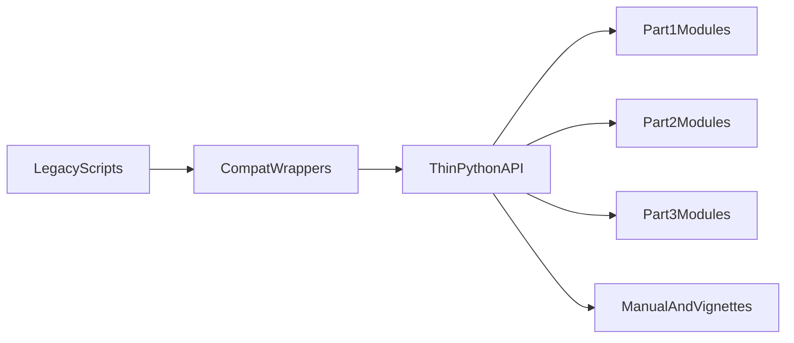

# DeepLB -> sxLaep-style Restructure Plan

## Goal
Restructure DeepLB toward a cleaner, sxLaep-style project organization with a strict safety-first approach:
- do not break any current functionality,
- for now, only make minimal, high-confidence changes to existing code,
- preserve current Part1/Part2/Part3 behavior as the primary constraint,
- improve usability through thin API/CLI wrappers and stronger docs.

This phase focuses on confidence and compatibility first, not deep rewrites.

## Guardrails (must hold for every change)
- No intentional algorithmic or modeling behavior changes.
- Existing shell entrypoints continue to work with current flags and data flow.
- Prefer additive wrappers/adapters over moving or rewriting legacy scripts.
- Any risky or broad refactor is deferred to a later phase after parity evidence.

## Phase 1: Sync and baseline lock
- Pull newest code from the current default remote branch in [/home/lcx/work/labxscut/DeepLB](/home/lcx/work/labxscut/DeepLB).
- Capture baseline command behavior and representative outputs before touching code.
- Record current CLI behavior from [`Scripts/DeepLB_pipeline.sh`](/home/lcx/work/labxscut/DeepLB/Scripts/DeepLB_pipeline.sh) and Part3 runner [`Scripts/Part3.ResTran_model_training/ResTran.sh`](/home/lcx/work/labxscut/DeepLB/Scripts/Part3.ResTran_model_training/ResTran.sh).
- Inventory high-risk config coupling in [`Scripts/Part2.Pseudo-fragment_Generation_by_mMTS/env_module.py`](/home/lcx/work/labxscut/DeepLB/Scripts/Part2.Pseudo-fragment_Generation_by_mMTS/env_module.py).
- Freeze a short do-not-change list for this phase (core model logic, file format contracts, and existing workflow semantics).

## Phase 2: Docs-first hardening (minimal risk, high value)
- Update [`README.md`](/home/lcx/work/labxscut/DeepLB/README.md) to match actual current behavior and remove drift/broken references.
- Add manual docs for setup and workflow execution as currently implemented.
- Add vignette-style examples that explain current commands and expected inputs/outputs.
- Include a compatibility section mapping current commands and data layout assumptions.

## Phase 3: Minimal sxLaep-style structure scaffolding
- Introduce a package-centric skeleton (sxLaep-style) with compatibility wrappers.
- Keep core logic in place; do not move or rewrite major scripts in this phase.
- Add thin module boundaries around existing orchestration to prepare future migration.
- Keep C++ toolchain under [`codes/reads_deconv`](/home/lcx/work/labxscut/DeepLB/codes/reads_deconv) and only standardize safe invocation boundaries.

## Phase 4: Minimal API and CLI improvements
- Add canonical Python API entrypoints as thin wrappers over existing flows.
- Keep legacy entrypoints as default/stable; new interfaces remain compatibility-first.
- Apply only low-risk CLI fixes (for example, clear flag consistency issues) where behavior intent is unambiguous.
- Defer any broad CLI redesign or flag normalization that could alter existing user workflows.

## Phase 5: Parity validation and handoff
- Verify no-regression parity on representative legacy workflows and outputs.
- Confirm API wrappers and CLI help surfaces work without changing semantics.
- Publish migration notes that clearly separate current safe changes from deferred refactors.

## Deferred to later phases
- Broad module relocation or deep code extraction.
- Large CLI redesign and cross-part argument standardization.
- Any change that requires reinterpretation of model/data assumptions.
